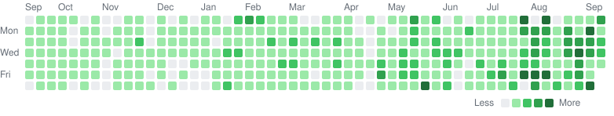

<!-- Profile Header -->
<h1 align="center">Hi 👋! My name is Tharsan Vishnukumar and I'm a fullstack developer from France 🇫🇷</h1>

  
  
  

---

## GitHub Stats

---

## GitHub Streak

---

## Tech Stack

### **Languages**

  

### **Frameworks & Libraries**

  

### **Databases & Backend Services**

  

### **Tools & Platforms**

  

---

## Featured Projects
- 🧪 **[Kouma Labs](https://koumalabs.org/)** — My app laboratory: privacy-first products that give users back control of their data
- 🥾 **[En Plein Air](https://enpleinair.koumalabs.org/)** — Hiking companion with metre-by-metre guidance, off-trail alerts and offline altitude-corrected weather *(React Native · Expo · Next.js)*
- ⚙️ **[Denvmon](https://github.com/freezer71/denvmon)** — TypeScript library for declarative environment variable validation with decorators

More on my portfolio → **[tharsan.me](https://www.tharsan.me/)**

---

## Activity Graph

<picture>
  <source media="(prefers-color-scheme: dark)" srcset="assets/contributions-dark.svg">
  
</picture>

---

## About Me
- Currently learning **Advanced Go & Typescript**
- Fullstack Developer passionate about **automation, web & mobile development**
- Focused on building **efficient and scalable projects**
- Building privacy-first apps under **[Kouma Labs](https://koumalabs.org/)**
- Based in **France** · Portfolio: **[tharsan.me](https://www.tharsan.me/)**
